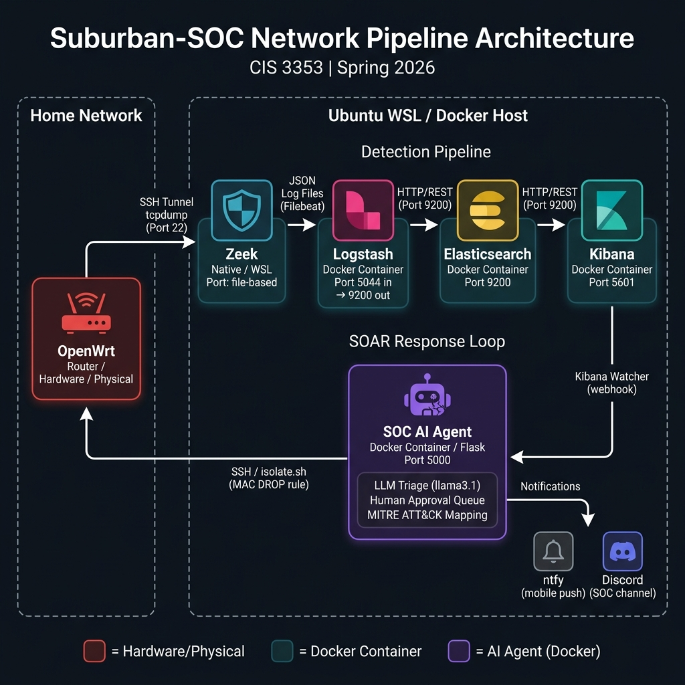

# Suburban-SOC Network Pipeline

## Table of Contents
- [Team Members](#team-members)
- [Course Modules](#course-modules)
- [Project Status](#project-status)
- [Architecture](#architecture)
- [Dashboard Architecture](#dashboard-architecture)
- [Overview](#overview)
- [Scope: Suburban-SOC Network Pipeline](#scope-suburban-soc-network-pipeline)
  - [Systems & Applications Targeted for Scanning](#systems--applications-targeted-for-scanning)
  - [Core Components & Functionalities of the Developed Tool](#core-components--functionalities-of-the-developed-tool)
  - [Security Domain & Vulnerabilities Covered](#security-domain--vulnerabilities-covered)
  - [Explicitly Out of Scope for this Project](#explicitly-out-of-scope-for-this-project)
- [Deliverables](#deliverables)
- [Repository Structure](#repository-structure)
- [Setup & Installation](#setup--installation)
  - [1. Prerequisites](#1-prerequisites)
  - [2. Installation Steps](#2-installation-steps)
  - [3. Usage](#3-usage)
- [Contribution Guidelines](#contribution-guidelines)
- [Testing & Validation](#testing--validation)
  - [1. Automated Testing](#1-automated-testing)
  - [2. Manual Testing](#2-manual-testing)
- [License](#license)
- [Additional Notes](#additional-notes)
  - [Project-Specific Considerations](#project-specific-considerations)
  - [Future Enhancements](#future-enhancements)
  - [Known Issues & Limitations](#known-issues--limitations)

## Team Members

| Name | GitHub Username | Role |
|---|---|---|
| Tommy Lammers | [@voltron-1](https://github.com/voltron-1) | System Architect / Engineer |
| Sterling Garnett | [@sterlinggarnett](https://github.com/sterlinggarnett) | Security Analyst / Engineer |


## Course Modules

This project directly covers the following course modules from CIS 3353 — Computer Systems Security:

| Module | Topic | Connection to Pipeline |
|---|---|---|
| **Module 2** | Network Fundamentals & Traffic Analysis | The core pipeline captures and analyzes raw boundary network traffic from our OpenWrt mesh router, applying the principles of packet inspection, protocol dissection, and traffic scoping covered in this module. |
| **Module 8** | Intrusion Detection Systems (IDS) | Zeek functions as our IDS engine, parsing PCAP captures into structured JSON logs and generating `notice.log` alerts for port scans, brute-force attempts, and anomalous file transfers — directly applying the detection methodology from this module. |
| **Module 9** | Security Operations & Incident Response | The ELK stack (Elasticsearch, Logstash, Kibana) forms our SOC dashboard layer, enabling log correlation, GeoIP enrichment, and real-time visualization of security events. Milestone 8 validates the full incident response lifecycle with simulated attack scenarios. |

## Project Status

Milestones mirror the [GitHub Milestones](https://github.com/sterlinggarnett/Suburban_SOC/milestones).
M1–M6 are the completed MVP; M7–M10 follow the four phases of the
[SOC Maturity Roadmap](docs/SOC-maturity-roadmap.md).

| Milestone | Title | Status |
|---|---|---|
| M1 | Topology | ✅ Complete |
| M2 | Data Acquisition (The Mesh Capture) | ✅ Complete |
| M3 | The Processing Pipeline (Zeek & Agent) | ✅ Complete |
| M4 | Data Visualization (ELK Integration) | ✅ Complete |
| M5 | Advanced Features / Automation | ✅ Complete |
| M6 | Presentation | ✅ Complete |
| M7 | Platform Security & Multi-Tenancy Foundation (Phase 0) | ✅ Complete (8/8 issues) |
| M8 | Detection Plane — NIST CSF Coverage & ATT&CK Depth (Phase 1) | ✅ Complete (5/5) |
| M9 | Operational Maturity (SOC-CMM Level 3) (Phase 2) | ✅ Complete (5/5) |
| M10 | SOC 2 Type II Technical Control Readiness (Phase 3) | 🚧 In progress — 3/7 (WS3.2, 3.5, 3.6) |

### M7 — Phase 0 workstream breakdown

Phase 0 ("secure the platform & lay the tenancy foundation") is the current focus —
no customer deploy ships before it closes.

| Workstream | Title | Status |
|---|---|---|
| WS0.1 | Authenticate & encrypt the Elastic stack (TLS + RBAC, least-priv accounts) | ✅ Complete |
| WS0.2 | Authenticate & harden the SOAR response webhook (HMAC, fail-closed) | ✅ Complete |
| WS0.3 | Multi-tenancy foundation (`tenant.id`, per-tenant indices/roles/response) | ✅ Complete (PR #117) |
| WS0.4 | Secrets management (`.env`, no hardcoded defaults) | ✅ Complete |
| WS0.5 | Data lifecycle & retention (data streams, ILM hot/warm/delete, snapshot-before-delete) | ✅ Complete (PR #121) |
| WS0.6 | Consolidate the duplicate Logstash config | ✅ Complete |

Plus two hardening tasks that complete the milestone (8/8): the SOAR response webhook
fix and **routing agent quarantine through the hive-mind-broker** (#109, PR #122) — the
slim agent container has no ssh/sudo, so containment is now an authenticated (HMAC)
IP-block dispatched to the broker, tenant-scoped, instead of a direct `isolate.sh` call.

### Recent Enhancements

Individual improvements merged toward the in-progress Phase 0 (M7) and detection
plane (M8) — these are work items within those milestones, not milestone completions:

- **Detection framework enrichment (PR #112).** `configs/logstash.conf` classifies
  detections into ECS `threat.technique.*` / `threat.tactic.*` and `nist.function`:
  all **10 Sigma rules** (`rules/sigma/`) plus the Zeek network detections (port
  scan `T1046`, SSH brute force `T1110`) — 12 techniques total. This powers the
  Executive dashboard's MITRE ATT&CK heatmap and NIST CSF donut. A stdlib test
  (`tests/pipeline/test_framework_enrichment.py`) keeps the rules and pipeline in sync.
- **SOAR response model (PR #113).** The AI agent now follows a human-in-the-loop
  posture (CDP §12.3/§12.4): the §12.4 **exclusion list** is checked first
  (protected infrastructure is never isolated *or* drafted); **autonomous
  containment is OFF by default** — a critical alert is *drafted* to an approval
  queue and a human executes it via `POST /approve`; auto-execution happens only
  when an operator opts in with `AUTONOMOUS_ISOLATION=true`. (This commit also
  repaired a non-functional merge of the agent module.)
- **Pipeline data quality (PR #111).** Composable ECS index templates pin field
  types (fixing silent aggregation failures), the Logstash CA-read issue is fixed,
  user-data indices are `green`, and `reindex-existing.sh` migrates legacy indices.
- **Multi-tenancy (PR #117).** Every event is edge-stamped with `tenant.id`; storage
  routes to per-tenant `logstash-security-<tenant>-*` indices with least-privilege ES
  roles (`provision_tenant.sh`); the agent and broker scope every response — isolation
  routing and notifications — to the alerting tenant's routers/topics, never broadcast.

## Architecture



The Suburban-SOC pipeline is a modular, end-to-end security monitoring and automated response system composed of the following components:

| Component | Runtime | Port | Role |
|---|---|---|---|
| **OpenWrt Router** | Hardware / Physical | — | Captures all boundary network traffic; receives MAC-level quarantine rules from the SOAR layer via SSH |
| **Zeek** | Native / WSL (`/opt/zeek/bin/zeek`) | File-based | Ingests raw PCAP via SSH/tcpdump, outputs structured JSON logs with Layer-2 MAC enrichment (`mac-logging` policy) |
| **Logstash** | Docker Container | 5044 in / 9200 out | Enriches, filters, and routes JSON logs; applies GeoIP lookups and ECS field mapping |
| **Elasticsearch** | Docker Container | 9200 | Indexes and stores all structured log data across three index patterns (`logstash-security-*`, `.alerts-security.alerts-*`, `soar-actions-*`) |
| **Kibana** | Docker Container | 5601 | Visualizes network events and threat dashboards; hosts the Watcher rule (`soar_quarantine_alert`) that triggers the SOAR loop |
| **SOC AI Agent** | Docker Container (Flask) | 5000 | Receives Kibana Watcher webhooks; runs LLM triage (MITRE ATT&CK mapping), then *drafts* containment to a human-approval queue executed via `POST /approve` (auto-isolation only with `AUTONOMOUS_ISOLATION=true`; protected assets excluded); sends ntfy + Discord notifications |
| **Hive-Mind Broker** | Python (FastAPI) | 8000 | Optional mesh dispatcher: receives an HMAC-signed block request and pushes firewall DROP rules to the OpenWrt mesh routers in `inventory.yaml` |

> For a full breakdown see the [Architecture Wiki page](../../wiki/Architecture).

## Dashboard Architecture

The SOC presents its telemetry through a **four-dashboard ecosystem** plus a navigation
hub, deployed via [`scripts/setup/deploy_dashboards.sh`](scripts/setup/deploy_dashboards.sh)
(PowerShell equivalent: `deploy_dashboards.ps1`). See
[SOP-003 Dashboard Operations](docs/SOP-003-dashboard-operations.md) for full procedures.

| # | Dashboard | Saved-object ID | Focus |
|---|---|---|---|
| 1 | **Executive / Bird's-Eye** | `executive-dashboard` | KPIs, NIST CSF donut, MITRE ATT&CK heatmap, SOAR response metrics |
| 2 | **Network & Traffic** | `network-dashboard-v3` | Traffic volume, top talkers, DNS, HTTP, TLS/SNI, GeoIP |
| 3 | **Endpoint & Host-Level** | `endpoint-dashboard` | Process anomalies, authentication, privilege escalation, Sigma hits |
| 4 | **Data Quality & Ingestion** | `dataquality-dashboard` | Agent heartbeats, ingest throughput, parse-error tracking |
| 🏠 | **SOC Home (Navigation Hub)** | `soc-navigation-hub` | Cross-dashboard links + at-a-glance KPIs |

Supporting pipeline enrichment lives in [`configs/logstash.conf`](configs/logstash.conf)
(MITRE/NIST tagging, TLS field mapping, endpoint Sigma tags, ingest-quality metadata),
[`configs/zeek/local.zeek`](configs/zeek/local.zeek) (TLS telemetry), and the AI agent's
SOAR feedback loop ([`agent_app.py`](scripts/setup/ai_agent/agent_app.py) →
`soar-actions-*`). Endpoint agents: [`configs/endpoint/`](configs/endpoint).

## Overview
**Suburban-SOC:** Mesh-based wireless network for suburban neighborhoods with centralized SOC management. Replaces insecure home networks with a unified system that captures and analyzes traffic for threats, delivering enterprise-grade security and simple, plug-and-play connectivity for homeowners.

The "Suburban-SOC Network Pipeline" is a software project developed by Tommy Lammers and Sterling Garnett for the Computer Systems Security course.

**Objective:**
The primary objective of this project is to enhance organizational cybersecurity defenses by building an end-to-end Zeek and ELK network packet analysis pipeline for an openWrt SOC. 

**Background:**
Network environments are frequently targeted by malicious actors. Regular and thorough network monitoring is crucial for identifying and addressing security gaps proactively. This pipeline provides a streamlined solution for capturing, parsing, and visualizing live network traffic efficiently.

**Key Functionalities:**
The tool is designed with a modular architecture and includes the following core functionalities:

1.  **Automated Network Traffic Analysis:**
    * A custom-built pipeline to monitor traffic using Zeek to parse raw PCAP data into structured JSON logs.
2.  **Comprehensive Reporting & Visualization:**
    * Generation of detailed dashboards using Kibana to outline discovered anomalies.
    * Data visualization features to provide an intuitive understanding of the security posture.
3.  **Data Processing & Routing:**
    * Using Filebeat and Logstash to securely ship, parse, and route logs to Elasticsearch.
4.  **Agile Development & Extensibility:**
    * Developed using an Agile methodology, emphasizing iterative development cycles.

## Scope: Suburban-SOC Network Pipeline
This project encompasses the design, development, and testing of an advanced **network packet analysis pipeline**. 

### Systems & Applications Targeted for Scanning:
* The tool is engineered to analyze and identify anomalies in **network traffic**. This includes dynamic routing, wireless access points, and devices on the OpenWrt router network.

### Baseline Traffic Monitoring Scope (Boundary Rules):
* To ensure system efficiency and targeted threat detection, the pipeline is configured to capture **only boundary HTTP traffic** entering and exiting the main router. This rule avoids processing internal network noise (e.g., local LAN file-sharing) and bypasses encrypted traffic that cannot be deeply inspected without a decryption proxy.

### Core Components & Functionalities of the Developed Tool:
* **Zeek Processing Engine:** Parses raw network packets into categorized JSON logs.
* **Logstash & Filebeat Forwarders:** Aggregates, filters, and forwards logs robustly.
* **Elasticsearch Database:** Stores and indexes log data efficiently.
* **Kibana UI:** A user-friendly interface to visualize metrics, initiate queries, and view security dashboards.
* **AI Agent & SOAR Quarantine:** Automated threat triage via LLM and instant OpenWrt MAC-based device isolation upon receiving high-confidence alerts.

### Security Domain & Vulnerabilities Covered:
* The primary focus is on **network security monitoring and threat detection** across the defined network segments monitored by the OpenWrt router.

### Explicitly Out of Scope for this Project:
* Scanning and vulnerability assessment of web applications directly.
* Automated exploitation or remediation of identified network vulnerabilities; the pipeline is strictly for identification and reporting.

## Deliverables
1.  **Group Project Presentation:**
    * A presentation showcasing the project's objectives, architecture, and outcomes.
2.  **Group Project Report (GitHub Wiki):**
    * For full project documentation, progress notes, and the final report, please visit our [Project Wiki](../../wiki).
3.  **GitHub Project with Agile Artifacts:**
    * A GitHub Project board utilized for Agile project management.
4.  **GitHub Repository:**
    * The complete source code and configurations for the Suburban-SOC Network Pipeline.

## Repository Structure
```
/ (root)
├── README.md                   # Project overview, setup, and documentation links
├── LICENSE                     # MIT License
├── validate_soc.sh             # SOC pipeline validation script
├── /configs                    # Pipeline and agent configurations
│   ├── /elasticsearch          # ECS index templates + apply/reindex helper scripts
│   ├── /endpoint               # Endpoint agents (Winlogbeat, Filebeat) + tenant edge-stamp
│   ├── /firewall               # OpenWrt firewall rules (placeholder)
│   ├── /intel                  # Zeek threat intelligence feed (intel.dat, config.zeek)
│   ├── /network                # Filebeat configuration (filebeat.yml)
│   ├── /server                 # Kibana dashboard exports (.ndjson)
│   └── /zeek_intel             # Zeek intel framework configs
├── /docs                       # Technical documentation
│   ├── SOP-001-pipeline-operations.md
│   ├── Zeek_ELK_Pipeline.md
│   ├── architecture-diagram.png
│   ├── logstash_validation.md
│   ├── master_pipeline_guide.md
│   ├── network_topology.md
│   ├── presentation_slides.md
│   └── /sprint-notes
├── /evidence                   # Pipeline proof — hashes and Kibana screenshots
│   └── /screenshots
├── /reports                    # Final project report (mirrors GitHub Wiki)
├── /scripts                    # All automation and setup scripts
│   ├── /agile                  # GitHub project board & issue management scripts
│   └── /setup                  # Pipeline setup, capture, and AI agent scripts
│       ├── /ai_agent           # SOC AI agent (Flask webhook, LLM triage, ntfy)
│       ├── /configs/logstash   # Logstash pipeline config (Docker source of truth)
│       ├── docker-compose.yml  # ELK + AI agent stack definition
│       └── soc_pipeline.sh     # Interactive SOP automation menu
└── /wiki-temp                  # GitHub Wiki source files (submodule)
```

## Setup & Installation
### 1. Prerequisites:
Before you begin, ensure you have the following:
* **Git:** For cloning the repository.
* **Docker / Docker Compose:** For running the ELK stack and Zeek containers.
* **OpenWrt Router:** properly configured with packet capture capabilities.

### 2. Installation Steps:
1.  **Clone the Repository:**
    ```bash
    git clone https://github.com/sterlinggarnett/Suburban_SOC.git
    cd Suburban_SOC
    ```
2.  **Configure Agents:**
    Review and modify `/configs/filebeat.yml` and `/configs/logstash.conf` to match your environment.
3.  **Configure Secrets:**
    The stack runs with security + TLS enabled. Copy the env template and set strong values:
    ```bash
    cp scripts/setup/.env.example scripts/setup/.env
    # edit .env: set ELASTIC_PASSWORD, KIBANA_PASSWORD, LOGSTASH_PASSWORD, KIBANA_ENCRYPTION_KEY (32+ chars)
    ```
4.  **Deploy Containers:**
    From `scripts/setup/`, run `docker compose up -d`. A one-shot `setup` service generates
    the TLS CA/certs and provisions service accounts; then Elasticsearch (`https://localhost:9200`),
    Logstash, Kibana (`http://localhost:5601`, login as `elastic`), and the AI agent come up.

### 3. Usage:
1.  **Architecture Flow:**
    **Detection:** `OpenWrt (SSH/tcpdump) ➔ Zeek (JSON + MAC enrichment) ➔ Filebeat ➔ Logstash ➔ Elasticsearch ➔ Kibana`  
    **Response:** `Kibana Watcher ➔ SOC AI Agent (LLM triage + approval queue) ➔ Hive-Mind Broker (HMAC) ➔ OpenWrt (nftables IP DROP)`  
    **Alerts:** `SOC AI Agent ➔ ntfy (mobile push) + Discord (SOC channel)`
2.  **Running the Pipeline:**
    Execute the relevant bash scripts in `/scripts/setup/` to begin streaming raw PCAP data over SSH.
3.  **Viewing Reports:**
    Navigate to Kibana (e.g., `http://localhost:5601`) to view the real-time visualizations and log queries.

## Contribution Guidelines
Please see our Wiki for detailed procedures on contributing to this project. We follow Agile methodologies including sprint tracking and GitHub Issue Management.

**Commit Approach:** This team uses **Delegated Commits**. All commits are routed through the designated Project Lead before being merged to the main branch. See our [Wiki: Commit-Approach](../../wiki/Commit-Approach) page for full details.

## Testing & Validation
### 1. Automated Testing:
* Unit tests and validation checks will be implemented for custom parser rules in Zeek and Logstash logic.
### 2. Manual Testing:
* Generating sample PCAP files containing known traffic signatures and verifying their appearance in the Kibana dashboard accurately.

## License
This project is licensed under the MIT License. (Make sure you include a `LICENSE` file to accompany this).

## Additional Notes
### Project-Specific Considerations:
* This tool was developed as a group project for the Computer Systems Security course.

### Future Enhancements:
* Implement an SSL/TLS inspection proxy (e.g., mitmproxy) to eliminate the HTTPS blind spot.
* Integrate live threat intelligence feeds (malicious IP/hash lists) directly into Zeek.
* Add 24-hour TTL auto-rollback for `SOAR_QUARANTINE_<MAC>` firewall rules.
* Stress-benchmark the OpenWrt → Zeek → Logstash pipeline under sustained high-volume traffic.
* Scale Elasticsearch to a multi-node cluster for replica-backed fault tolerance (single-node `green` health is already achieved via `number_of_replicas: 0` in the index templates).

### Known Issues & Limitations:
* Elasticsearch runs as a single node. User-data indices (`logstash-security-*`, `soar-actions-*`) are `green` via the index templates' `number_of_replicas: 0`; some Elastic-managed system indices remain `yellow` (replicas unassigned on one node). Single-node has no replica fault tolerance — not yet production-ready.
* The pipeline cannot inspect the payload of HTTPS traffic without an active SSL/TLS decryption proxy.
* OpenWrt gateway streaming throughput has not been stress-tested; performance under extreme load is unknown.


