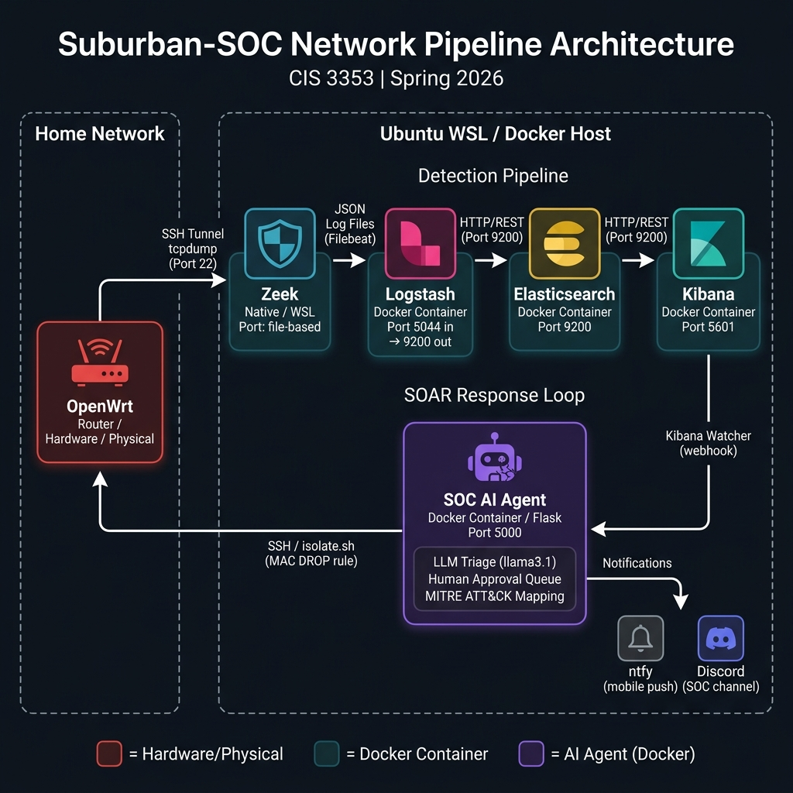

# Suburban-SOC Network Pipeline

## Table of Contents
- [Team Members](#team-members)
- [Course Modules](#course-modules)
- [Project Status](#project-status)
- [Architecture](#architecture)
- [Dashboard Architecture](#dashboard-architecture)
- [Overview](#overview)
- [Scope: Suburban-SOC Network Pipeline](#scope-suburban-soc-network-pipeline)
  - [Systems & Applications Targeted for Scanning](#systems--applications-targeted-for-scanning)
  - [Core Components & Functionalities of the Developed Tool](#core-components--functionalities-of-the-developed-tool)
  - [Security Domain & Vulnerabilities Covered](#security-domain--vulnerabilities-covered)
  - [Explicitly Out of Scope for this Project](#explicitly-out-of-scope-for-this-project)
- [Deliverables](#deliverables)
- [Repository Structure](#repository-structure)
- [Setup & Installation](#setup--installation)
  - [1. Prerequisites](#1-prerequisites)
  - [2. Installation Steps](#2-installation-steps)
  - [3. Usage](#3-usage)
- [Contribution Guidelines](#contribution-guidelines)
- [Testing & Validation](#testing--validation)
  - [1. Automated Testing](#1-automated-testing)
  - [2. Manual Testing](#2-manual-testing)
- [License](#license)
- [Additional Notes](#additional-notes)
  - [Project-Specific Considerations](#project-specific-considerations)
  - [Future Enhancements](#future-enhancements)
  - [Known Issues & Limitations](#known-issues--limitations)

## Team Members

| Name | GitHub Username | Role |
|---|---|---|
| Tommy Lammers | [@voltron-1](https://github.com/voltron-1) | System Architect / Engineer |
| Sterling Garnett | [@sterlinggarnett](https://github.com/sterlinggarnett) | Security Analyst / Engineer |


## Course Modules

This project directly covers the following course modules from CIS 3353 — Computer Systems Security:

| Module | Topic | Connection to Pipeline |
|---|---|---|
| **Module 2** | Network Fundamentals & Traffic Analysis | The core pipeline captures and analyzes raw boundary network traffic from our OpenWrt mesh router, applying the principles of packet inspection, protocol dissection, and traffic scoping covered in this module. |
| **Module 8** | Intrusion Detection Systems (IDS) | Zeek functions as our IDS engine, parsing PCAP captures into structured JSON logs and generating `notice.log` alerts for port scans, brute-force attempts, and anomalous file transfers — directly applying the detection methodology from this module. |
| **Module 9** | Security Operations & Incident Response | The ELK stack (Elasticsearch, Logstash, Kibana) forms our SOC dashboard layer, enabling log correlation, GeoIP enrichment, and real-time visualization of security events. Milestone 8 validates the full incident response lifecycle with simulated attack scenarios. |

## Project Status

Milestones mirror the [GitHub Milestones](https://github.com/voltron-1/Suburban_SOC/milestones).
M1–M6 are the completed MVP; M7–M11 follow the phases of the
[SOC Maturity Roadmap](docs/SOC-maturity-roadmap.md); M12 is a
post-remediation integrity + detection-tuning pass filed after M11 shipped.
M14–M16 were opened 2026-08-05 to triage the follow-up issues that M11/M12's
security reviews filed — work that was real but deliberately out of scope for
the issue being fixed at the time, and which had accumulated untracked.
**Restructured 2026-08-16:** the same pattern recurred — by mid-August the
backlog had grown to 37 open issues, 33 with no milestone at all. M15
closed outright (its last item, #283, moved to its true thematic home);
every open issue was re-sorted into 6 new milestones, M17–M22, and M16
was narrowed back to its original scope.

| Milestone | Title | Status |
|---|---|---|
| M1 | Topology | ✅ Complete |
| M2 | Data Acquisition (The Mesh Capture) | ✅ Complete |
| M3 | The Processing Pipeline (Zeek & Agent) | ✅ Complete |
| M4 | Data Visualization (ELK Integration) | ✅ Complete |
| M5 | Advanced Features / Automation | ✅ Complete |
| M6 | Presentation | ✅ Complete |
| M7 | Platform Security & Multi-Tenancy Foundation (Phase 0) | ✅ Complete (8/8 issues) |
| M8 | Detection Plane — NIST CSF Coverage & ATT&CK Depth (Phase 1) | ✅ Complete (5/5) |
| M9 | Operational Maturity (SOC-CMM Level 3) (Phase 2) | ✅ Complete (5/5) |
| M10 | SOC 2 Type II Technical Control Readiness (Phase 3) | ✅ Complete — 7/7 (WS3.1–3.7) |
| M11 | Agent Orchestration & Compliance (Phase 4) | ✅ Complete (merged 2026-07-20) |
| M12 | Approval Gate Integrity & Detection Engineering Tuning | ✅ Complete (14/14 issues, closed 2026-08-05) — restored the atomic approval claim dropped by `2bb3d8f`, then hardened it three more times via #245/#246/#247/#273 |
| M13 | Detection Expansion: 35 → 105 Sigma Rules (Campus SOC) | ✅ Complete (25/25 issues, [milestone](https://github.com/voltron-1/Suburban_SOC/milestone/17)) — all 7 rule-batch user stories merged; corpus grew 35 → 108 rules |
| M14 | SOAR Approval-Plane Operability & Hardening | ✅ Complete (8/8 issues, [milestone](https://github.com/voltron-1/Suburban_SOC/milestone/18), closed 2026-08-09) — both P0 defects (#275, #277) plus operator tooling for stuck claims |
| M15 | Detection Correctness & Pipeline Fidelity | ✅ Complete (11/11 issues, [milestone](https://github.com/voltron-1/Suburban_SOC/milestone/19)) — whether the *existing* corpus behaves as written, as opposed to M13's rule count. Closed 2026-08-16; its one blocked item (#283) moved to M17, its true thematic home |
| M16 | Endpoint Onboarding & Threat-Intel Integrity | ⏸️ 7/8 closed, 1 deferred ([milestone](https://github.com/voltron-1/Suburban_SOC/milestone/20), no actionable work left) — threat-intel retraction (#271), zeek/zeek image pin+CVE bump (#293, #364), and 2 detection-gap follow-ups (#358, #361) all shipped; only #265 (client certs for endpoint shippers) remains, gated on a real endpoint being deployed |
| M17 | Detection Rule Coverage & Correctness | ⏸️ 6/8 closed, 2 not actionable ([milestone](https://github.com/voltron-1/Suburban_SOC/milestone/22), no actionable work left) — Sigma rule logic gaps, spoofable/evadable detections, threshold-band blind spots, and coverage-metric accuracy all closed; #283 (externally blocked) and #333 (speculative/deprioritized) remain |
| M18 | ECS Pipeline & Field-Mapping Integrity | ⏸️ 12/16 closed, 4 not actionable ([milestone](https://github.com/voltron-1/Suburban_SOC/milestone/23), no actionable work left) — Logstash rename/copy drift vs. what suburban-soc-ecs.yml claims, dashboard fields that don't exist on the real mapping, truncation ceilings, and index-template rollover all closed; #326 (externally blocked, needs real Windows/PowerShell telemetry) and 3 review-discovered follow-ups (#396, #403, #405), each deliberately scoped out of the fix that found it, remain |
| M19 | SOC Platform Credential & Secret Hygiene | 📋 Planned ([milestone](https://github.com/voltron-1/Suburban_SOC/milestone/24), 6 issues) — cleartext passwords in argv, ES role drift with no sync check, no live self-check on role regressions, unpinned CI toolchain, ES network exposure |
| M20 | SOAR Response-Path Hardening | 📋 Planned ([milestone](https://github.com/voltron-1/Suburban_SOC/milestone/25), 3 issues) — residual hive-mind-broker/#277 hardening, autonomous-isolation MAC-gate policy decision |
| M21 | Zeek Sensor Operational Resilience | 📋 Planned ([milestone](https://github.com/voltron-1/Suburban_SOC/milestone/26), 3 issues) — no liveness/dead-man detection for a silently-dead capture source; symlink/ownership primitives; CA trust-on-every-use |
| M22 | Compliance & Documentation Accuracy | 📋 Planned ([milestone](https://github.com/voltron-1/Suburban_SOC/milestone/27), 3 issues) — docs/compliance matrix citing dead code as a live control; a tagging mandate never implemented; analyst-facing rule text leaking implementation detail |

> **What "✅ Complete" means here (scope note, audit P1-12/P1-13).** A milestone is
> marked complete when its tracked issues/workstreams were implemented and merged —
> it is **not** a claim of independent operational validation, sustained-period
> evidence, or third-party certification. In particular:
> - **SOC 2 Type II (M10)** here means the *technical control design is in place*
>   ("readiness"), **not** that an audited Type II report exists — Type II requires
>   controls operating over a defined period, and the change-evidence ledger
>   ([`docs/deploy-changelog.md`](docs/deploy-changelog.md)) is not yet populated
>   from real deploys.
> - **SOC-CMM Level 3 (M9)** is a *self-assessed* maturity target, not an external
>   rating.
> - The [SOC Maturity Roadmap](docs/SOC-maturity-roadmap.md) is the design/target
>   source of truth; where it, the wiki, or sprint notes disagree with this table,
>   treat them as the more conservative current state and reconcile before citing
>   "complete" externally.

### M7 — Phase 0 workstream breakdown

Phase 0 ("secure the platform & lay the tenancy foundation") is the current focus —
no customer deploy ships before it closes.

| Workstream | Title | Status |
|---|---|---|
| WS0.1 | Authenticate & encrypt the Elastic stack (TLS + RBAC, least-priv accounts) | ✅ Complete |
| WS0.2 | Authenticate & harden the SOAR response webhook (HMAC, fail-closed) | ✅ Complete |
| WS0.3 | Multi-tenancy foundation (`tenant.id`, per-tenant indices/roles/response) | ✅ Complete (PR #117) |
| WS0.4 | Secrets management (`.env`, no hardcoded defaults) | ✅ Complete |
| WS0.5 | Data lifecycle & retention (data streams, ILM hot/warm/delete, snapshot-before-delete) | ✅ Complete (PR #121) |
| WS0.6 | Consolidate the duplicate Logstash config | ✅ Complete |

Plus two hardening tasks that complete the milestone (8/8): the SOAR response webhook
fix and **routing agent quarantine through the hive-mind-broker** (#109, PR #122) — the
slim agent container has no ssh/sudo, so containment is now an authenticated (HMAC)
IP-block dispatched to the broker, tenant-scoped, instead of a direct `isolate.sh` call.

### Recent Enhancements

Individual improvements merged across the milestones above — these are work items
within a milestone, not milestone completions in their own right:

- **zeek/zeek image pinned, then patched for 7 CRITICAL CVEs (M16, #293/#355/#364).**
  The network sensor's Docker image (parses fully attacker-controlled traffic) was
  running unpinned (`:latest`), a supply-chain drift risk that had already silently
  broken a Sigma rule once (an OpenSSL wording change between builds). #293 pinned
  it to a specific tag+digest; #355 added Trivy CI coverage for that exact
  reference (self-built images were already scanned, this third-party one wasn't);
  live-scanning it immediately surfaced 7 real, fixed CRITICAL CVEs on the pin
  (libgnutls30t64, libssl3t64/openssl, libnode115/nodejs). #364 bumped to 8.2.1,
  closing all 7 — re-verifying every Zeek/OpenSSL-version-dependent surface the
  bump could plausibly break (not just the one field the original incident
  touched): Sigma rules matching exact OpenSSL error strings, SSH/Intel enum
  names, and `files.log` MIME-type detection, each checked against real traffic
  through both the old and new image and diffed byte-identical. Also found and
  fixed a real, live bug the pin itself exposed: the evidence-validation runbook's
  `docker ps --filter ancestor=<tag>` command doesn't reliably match a container
  started via `repo:tag@digest`, switched to name-based filtering that survives
  future bumps without further edits.
- **Backlog restructured into properly-scoped milestones (2026-08-16).** 37 open
  issues had accumulated, 33 with no milestone at all — real review follow-ups
  filed across M12–M16 and never triaged, invisible to any milestone-based view.
  Sorted by theme into 6 new milestones (M17 detection-rule correctness, M18 ECS
  pipeline/field-mapping integrity, M19 platform credential hygiene, M20 SOAR
  response-path hardening, M21 Zeek sensor resilience, M22 compliance/docs
  accuracy); M15 closed outright once its one open item moved to its real
  thematic home in M17.
- **Agent orchestration refactor + approval-gate integrity (M11 → M12).** M11
  restructured the SOC AI agent into an explicit Perceive→Think→Act→Check `Agent`
  class with ES-backed checkpoints (`scripts/setup/ai_agent/agent.py`), merged
  2026-07-20. That merge went directly to `main` without a PR, so the
  security-critical `SOAR auth / exclusion / approval / tenant-scoping` CI gate
  (which triggers only on `pull_request`) never ran against it — it silently
  dropped the atomic claim that guarantees `/approve` executes an isolation
  action at most once, reopening a double-execution race. M12
  ([#213](https://github.com/voltron-1/Suburban_SOC/issues/213)) restored it via
  an Elasticsearch atomic create-if-absent claim
  ([PR #248](https://github.com/voltron-1/Suburban_SOC/pull/248), merged
  2026-08-02), fixed the test suite the same merge had silently broken, and
  tracks the infrastructure gaps
  ([#245](https://github.com/voltron-1/Suburban_SOC/issues/245),
  [#246](https://github.com/voltron-1/Suburban_SOC/issues/246)) the review
  surfaced along the way — those and the rest of M12's phases remain open.
- **Detection corpus mapping fix (M13, PR #253).** A security review of M13's
  first rule batch found `process.args` (and `process.parent.args`,
  `*ScriptBlockText`, and related fields) indexed as plain `keyword` with
  `ignore_above: 1024` and no normalizer — meaning Sigma's lowercase literals
  could silently fail to match real mixed-case Windows telemetry, and any
  command line over 1024 characters was silently dropped from the index
  entirely. Both affected **all 45 pre-existing Sigma rules**, not just the
  new batch. Fixed via a custom lowercase normalizer + `ignore_above: 8191`
  ([PR #253](https://github.com/voltron-1/Suburban_SOC/pull/253), merged
  2026-08-02; closes #249/#250), live-verified against the running cluster,
  and rolled out to every tenant's `logstash-security-*` data stream via a
  non-destructive rollover.
- **Field-truncation visibility (#252).** #253's `ignore_above: 8191` fixed
  the 1024 ceiling for most command-line fields, but PowerShell 4104
  `ScriptBlockText` chunks commonly run past 8191 — live-verified: a
  synthetic 8516-character value containing a real obfuscation indicator
  (`FromBase64String`) was silently unqueryable while staying intact in
  `_source`, the exact blind spot `posh_ps_obfuscated_scriptblock.yml`
  exists to catch. `configs/logstash.conf` now tags `pipeline.truncated`
  (+ which field) when `process.args`/`process.parent.args`/`ScriptBlockText`
  exceed the ceiling; `metric_field_truncation_count()` turns that into a
  measured, `NO_TARGET` SLO baseline rather than a guessed number. Live
  verification of this fix surfaced two unrelated, pre-existing outages it
  had to fix to even restart `logstash`: `LOGSTASH_ENRICH_PASSWORD` (#286)
  was never in `scripts/setup/.env`, so the `logstash_enrich` ES identity
  had never actually been provisioned; and a stray apostrophe in a
  `docker-compose.yml` comment (introduced by #257/PR #315) silently
  truncated the entire `provision` service's bootstrap script after its
  third command — the same interpolation-fragility class #303 fixed for
  Compose's variable pass, but on the runtime shell-parsing side, which no
  existing CI check catches.
- **PowerShell/service-binPath payload-length bypass fix (M15, #263).** #252
  made truncation measurable but deliberately left the 8191 ceiling in
  place, pending data. #263 (filed earlier, during #217's review) already
  had enough to act on without new data: Windows' own `CreateProcess`
  command-line limit is ~32,767 characters and 4104 chunks commonly run
  ~20,000, both of which silently exceeded the 8191 `ignore_above` ceiling
  and evaded `proc_creation_win_powershell_encoded.yml`,
  `posh_ps_obfuscated_scriptblock.yml`, and
  `system_win_suspicious_service_binpath_lolbin.yml` on any realistic
  payload, not an edge case. Raised to 32766 for `process.args`/
  `process.parent.args`/`winlog.event_data.ScriptBlockText`/
  `winlog.event_data.ImagePath` and the `long_command_fields`
  dynamic_template; `configs/logstash.conf`'s truncation-tag ceiling kept in
  lockstep (now a CI-enforced test, not just a comment) so
  `pipeline.truncated` doesn't false-fire on values that are now correctly
  indexed. Applied to the live template and rolled over across every
  tenant's `logstash-security-*` data stream (non-destructive — history
  keeps its old mapping until it ages out under ILM, same pattern as #253).
  A parallel security-auditor + code-reviewer pass, followed by live
  empirical verification, found the first version of this fix introduced a
  worse bug than the one it closed: `ignore_above` is a *character* ceiling,
  but Lucene's own per-term hard limit is a UTF-8 *byte* ceiling — a value
  under the char ceiling but byte-heavy (multi-byte content, e.g. Unicode
  identifier obfuscation in `ScriptBlockText`) crashed the *whole document*
  at index time (confirmed live: HTTP 400, Lucene "immense term" rejection)
  instead of just dropping the one field. Fixed with a byte-safety clamp in
  the ruby filter (tagged `pipeline.byte_clamped`, its own new
  `metric_field_byte_clamp_count()` SLO metric) that only activates in the
  narrow window `ignore_above` itself cannot cover. The same review also
  found — and live-confirmed via a spliced-pipeline replay of the real
  filter — that the truncation tag had silently never worked for
  `process.args`/`process.parent.args` on real Sysmon-sourced events at all:
  the pipeline's Sysmon `mutate.rename` block targets bare dotted strings
  (`"process.args"`), which Logstash creates as a flat literal field rather
  than the nested structure the filter's lookups expected. Worked around
  locally with a fallback lookup; the rename block itself (touching 9 fields
  across the whole Sysmon rule surface) is deliberately left for its own
  dedicated follow-up (filed as
  [#328](https://github.com/voltron-1/Suburban_SOC/issues/328)) rather than
  expanding this fix's blast radius.
- **Detection framework enrichment (PR #112).** The detection plane spans
  **75 ATT&CK techniques across 12 tactics** (see [`docs/detections/attack-coverage.md`](docs/detections/attack-coverage.md) for the authoritative coverage matrix). The
  **108 Sigma rules** (`rules/sigma/`) each carry their own ATT&CK technique tag and
  convert to Elastic SIEM rules via pySigma (`deploy_detections.sh`) — the rules,
  not the pipeline, are the single source of truth for endpoint detection. In
  addition, `configs/logstash.conf` classifies the two Zeek **network** detections —
  port scan `T1046`, SSH brute force `T1110` — into ECS `threat.technique.*` /
  `threat.tactic.*` / `nist.function`. Together these power the Executive
  dashboard's MITRE ATT&CK heatmap and NIST CSF donut. A stdlib test
  (`tests/pipeline/test_framework_enrichment.py`) keeps the Zeek pipeline enrichment
  in sync with the rule corpus (and asserts endpoint Sigma logic is *not* inlined in
  the pipeline).
- **SOAR response model (PR #113).** The AI agent now follows a human-in-the-loop
  posture (CDP §12.3/§12.4): the §12.4 **exclusion list** is checked first
  (protected infrastructure is never isolated *or* drafted); **autonomous
  containment is OFF by default** — a critical alert is *drafted* to an approval
  queue and a human executes it via `POST /approve` (HMAC-authenticated;
  `/pending` is signed too — unsigned calls fail closed with 401; since #246 both
  verify against a credential separate from `/alert`'s — see below);
  auto-execution happens only
  when an operator opts in with `AUTONOMOUS_ISOLATION=true`. (This commit also
  repaired a non-functional merge of the agent module.)
- **Pipeline data quality (PR #111).** Composable ECS index templates pin field
  types (fixing silent aggregation failures), the Logstash CA-read issue is fixed,
  user-data indices are `green`, and `reindex-existing.sh` migrates legacy indices.
- **Multi-tenancy (PR #117).** Every event is edge-stamped with `tenant.id`; storage
  routes to per-tenant `logstash-security-<tenant>-*` indices with least-privilege ES
  roles (`provision_tenant.sh`); the agent and broker scope every response — isolation
  routing and notifications — to the alerting tenant's routers/topics, never broadcast.
- **Compliance & Standardization (In Progress).** Integrated a robust compliance matrix
  mapped to NIST CSF, 800-171/53, and CIS Controls. Enhanced the Elastic pipeline
  with ABAC (Attribute-Based Access Control) lookups via `translate` filters and
  standardized all Playbooks and SOPs using structural templates.

## Architecture



The Suburban-SOC pipeline is a modular, end-to-end security monitoring and automated response system composed of the following components:

| Component | Runtime | Port | Role |
|---|---|---|---|
| **OpenWrt Router** | Hardware / Physical | — | Captures all boundary network traffic; receives MAC-level quarantine rules from the SOAR layer via SSH |
| **Zeek** | Native / WSL (`/opt/zeek/bin/zeek`) | File-based | Ingests raw PCAP via SSH/tcpdump, outputs structured JSON logs. Layer-2 MAC enrichment (`mac-logging` policy) is planned but not currently loaded on any real capture path — [#286](https://github.com/voltron-1/Suburban_SOC/issues/286) |
| **Logstash** | Docker Container | 5044 in / 9200 out | Enriches, filters, and routes JSON logs; applies GeoIP lookups and ECS field mapping |
| **Elasticsearch** | Docker Container | 9200 | Indexes and stores all structured log data across three index patterns (`logstash-security-*`, `.alerts-security.alerts-*`, `soar-actions-*`) |
| **Kibana** | Docker Container | 5601 | Visualizes network events and threat dashboards |
| **SOC AI Agent** | Docker Container (Flask) | 5000 | Receives an HMAC-signed `/alert` webhook from Logstash's own ingest-time trigger (`configs/logstash.conf`, not a Kibana Watcher — the original Watcher-based design was retired, [#267](https://github.com/voltron-1/Suburban_SOC/issues/267)); runs LLM triage (MITRE ATT&CK mapping), then *drafts* containment to a human-approval queue executed via `POST /approve` (auto-isolation only with `AUTONOMOUS_ISOLATION=true`; protected assets excluded); sends ntfy + Discord notifications |
| **Hive-Mind Broker** | Python (FastAPI) | 8000 | Optional mesh dispatcher: receives an HMAC-signed block request and pushes firewall DROP rules to the OpenWrt mesh routers in `inventory.yaml` |

> For a full breakdown see the [Architecture Wiki page](../../wiki/Architecture).

## Dashboard Architecture

The SOC presents its telemetry through a **four-dashboard ecosystem** plus a navigation
hub, deployed via [`scripts/setup/deploy_dashboards.sh`](scripts/setup/deploy_dashboards.sh)
(PowerShell equivalent: `deploy_dashboards.ps1`). See
[SOP-003 Dashboard Operations](docs/SOP-003-dashboard-operations.md) for full procedures.

| # | Dashboard | Saved-object ID | Focus |
|---|---|---|---|
| 1 | **Executive / Bird's-Eye** | `executive-dashboard` | KPIs, NIST CSF donut, MITRE ATT&CK heatmap, SOAR response metrics |
| 2 | **Network & Traffic** | `network-dashboard-v3` | Traffic volume, top talkers, DNS, HTTP, TLS/SNI, GeoIP |
| 3 | **Endpoint & Host-Level** | `endpoint-dashboard` | Process anomalies, authentication, privilege escalation, Sigma hits |
| 4 | **Data Quality & Ingestion** | `dataquality-dashboard` | Agent heartbeats, ingest throughput, parse-error tracking |
| 🏠 | **SOC Home (Navigation Hub)** | `soc-navigation-hub` | Cross-dashboard links + at-a-glance KPIs |

Supporting pipeline enrichment lives in [`configs/logstash.conf`](configs/logstash.conf)
(MITRE/NIST tagging, TLS field mapping, endpoint Sigma tags, ingest-quality metadata),
[`configs/zeek/local.zeek`](configs/zeek/local.zeek) (TLS telemetry), and the AI agent's
SOAR feedback loop ([`agent_app.py`](scripts/setup/ai_agent/agent_app.py) →
`soar-actions-*`). Endpoint agents: [`configs/endpoint/`](configs/endpoint).

## Overview
**Suburban-SOC:** Mesh-based wireless network for suburban neighborhoods with centralized SOC management. Replaces insecure home networks with a unified system that captures and analyzes traffic for threats, delivering enterprise-grade security and simple, plug-and-play connectivity for homeowners.

The "Suburban-SOC Network Pipeline" is a software project developed by Tommy Lammers and Sterling Garnett for the Computer Systems Security course.

**Objective:**
The primary objective of this project is to enhance organizational cybersecurity defenses by building an end-to-end Zeek and ELK network packet analysis pipeline for an openWrt SOC. 

**Background:**
Network environments are frequently targeted by malicious actors. Regular and thorough network monitoring is crucial for identifying and addressing security gaps proactively. This pipeline provides a streamlined solution for capturing, parsing, and visualizing live network traffic efficiently.

**Key Functionalities:**
The tool is designed with a modular architecture and includes the following core functionalities:

1.  **Automated Network Traffic Analysis:**
    * A custom-built pipeline to monitor traffic using Zeek to parse raw PCAP data into structured JSON logs.
2.  **Comprehensive Reporting & Visualization:**
    * Generation of detailed dashboards using Kibana to outline discovered anomalies.
    * Data visualization features to provide an intuitive understanding of the security posture.
3.  **Data Processing & Routing:**
    * Using Filebeat and Logstash to securely ship, parse, and route logs to Elasticsearch.
4.  **Agile Development & Extensibility:**
    * Developed using an Agile methodology, emphasizing iterative development cycles.

## Scope: Suburban-SOC Network Pipeline
This project encompasses the design, development, and testing of an advanced **network packet analysis pipeline**. 

### Systems & Applications Targeted for Scanning:
* The tool is engineered to analyze and identify anomalies in **network traffic**. This includes dynamic routing, wireless access points, and devices on the OpenWrt router network.

### Baseline Traffic Monitoring Scope (Boundary Rules):
* To ensure system efficiency and targeted threat detection, the pipeline is configured to capture **only boundary HTTP traffic** entering and exiting the main router. This rule avoids processing internal network noise (e.g., local LAN file-sharing) and bypasses encrypted traffic that cannot be deeply inspected without a decryption proxy.

### Core Components & Functionalities of the Developed Tool:
* **Zeek Processing Engine:** Parses raw network packets into categorized JSON logs.
* **Logstash & Filebeat Forwarders:** Aggregates, filters, and forwards logs robustly.
* **Elasticsearch Database:** Stores and indexes log data efficiently.
* **Kibana UI:** A user-friendly interface to visualize metrics, initiate queries, and view security dashboards.
* **AI Agent & SOAR Quarantine:** Automated threat triage via LLM and instant OpenWrt MAC-based device isolation upon receiving high-confidence alerts.

### Security Domain & Vulnerabilities Covered:
* The primary focus is on **network security monitoring and threat detection** across the defined network segments monitored by the OpenWrt router.

### Explicitly Out of Scope for this Project:
* Scanning and vulnerability assessment of web applications directly.
* Automated exploitation or remediation of identified network vulnerabilities; the pipeline is strictly for identification and reporting.

## Deliverables
1.  **Group Project Presentation:**
    * A presentation showcasing the project's objectives, architecture, and outcomes.
2.  **Group Project Report (GitHub Wiki):**
    * For full project documentation, progress notes, and the final report, please visit our [Project Wiki](https://github.com/voltron-1/Suburban_SOC/wiki).
3.  **GitHub Project with Agile Artifacts:**
    * A GitHub Project board ([Behavioral_Based_Detection_for_Distributed_Networks](https://github.com/users/voltron-1/projects/17)) utilized for Agile project management, currently tracking the NIST CSF and SOC-CMM gap analysis implementation.
4.  **GitHub Repository:**
    * The complete source code and configurations for the Suburban-SOC Network Pipeline.

## Repository Structure
```
/ (root)
├── README.md                   # Project overview, setup, and documentation links
├── LICENSE                     # MIT License
├── /configs                    # Pipeline and agent configurations
│   ├── /elasticsearch          # ECS index templates + apply/reindex helper scripts
│   ├── /endpoint               # Endpoint agents (Winlogbeat, Filebeat) + tenant edge-stamp
│   ├── /firewall               # OpenWrt firewall rules (placeholder)
│   ├── /intel                  # Zeek threat intelligence feed (intel.dat, config.zeek)
│   ├── /network                # Filebeat configuration (filebeat.yml)
│   ├── /server                 # Kibana dashboard exports (.ndjson)
│   ├── /zeek                    # Zeek TLS/telemetry policy (local.zeek)
│   └── /detections             # ECS field pipeline (suburban-soc-ecs.yml)
├── /docs                       # Technical documentation and Standard Operating Procedures (SOPs)
│   ├── SOP-001-pipeline-operations.md
│   ├── SOP-003-dashboard-operations.md
│   ├── SOP-004-data-retention.md
│   ├── SOP-005-reliability.md
│   ├── SOP-007-change-management.md
│   ├── SOP-008-vuln-management.md
│   ├── SOP-009-rbac.md
│   ├── SOP-010-audit-trail.md
│   ├── SOP-011-encryption.md
│   ├── SOP-012-privacy-data-handling.md
│   ├── SOP-013-ccm.md
│   ├── SOP-022-anomaly-validation.md
│   ├── SOP-147-evidence-validation-runbook.md
│   ├── Playbook-Structure.md
│   ├── Zeek_ELK_Pipeline.md
│   ├── architecture-diagram.png
│   ├── logstash_validation.md
│   ├── master_pipeline_guide.md
│   ├── network_topology.md
│   ├── presentation_slides.md
│   └── /sprint-notes
├── /evidence                   # Pipeline proof — hashes and Kibana screenshots
│   └── /screenshots
├── /reports                    # Final project report (mirrors GitHub Wiki)
└── /scripts                    # All automation and setup scripts
    └── /setup                  # Pipeline setup, capture, and AI agent scripts
        ├── /ai_agent           # SOC AI agent (Flask webhook, LLM triage, ntfy)
        ├── /hive-mind-broker   # (../) HMAC router-block dispatcher (FastAPI)
        ├── docker-compose.yml  # ELK + AI agent stack (mounts ../../configs/logstash.conf)
        └── soc_pipeline.sh     # Interactive SOP automation menu
```

## Setup & Installation
### 1. Prerequisites:
Before you begin, ensure you have the following:
* **Git:** For cloning the repository.
* **Docker / Docker Compose:** For running the ELK stack and Zeek containers.
* **OpenWrt Router:** properly configured with packet capture capabilities.

### 2. Installation Steps:
1.  **Clone the Repository:**
    ```bash
    git clone https://github.com/voltron-1/Suburban_SOC.git
    cd Suburban_SOC
    ```
2.  **Configure Agents:**
    Review and modify `/configs/network/filebeat.yml` and `/configs/logstash.conf` to match your environment.
3.  **Configure Secrets:**
    The stack runs with security + TLS enabled. Copy the env template and set strong values:
    ```bash
    cp scripts/setup/.env.example scripts/setup/.env
    # edit .env: set ELASTIC_PASSWORD, KIBANA_PASSWORD, LOGSTASH_PASSWORD, KIBANA_ENCRYPTION_KEY (32+ chars)
    ```
4.  **Deploy Containers:**
    From `scripts/setup/`, run `docker compose up -d`. A one-shot `setup` service generates
    the TLS CA/certs and provisions service accounts; then Elasticsearch (`https://localhost:9200`),
    Logstash, Kibana (`https://localhost:5601`, login as `elastic`), and the AI agent come up.

### 3. Usage:
1.  **Architecture Flow:**
    **Detection:** `OpenWrt (SSH/tcpdump) ➔ Zeek (JSON + MAC enrichment) ➔ Filebeat ➔ Logstash ➔ Elasticsearch ➔ Kibana`  
    **Response:** `Kibana Watcher ➔ SOC AI Agent (LLM triage + approval queue) ➔ Hive-Mind Broker (HMAC) ➔ OpenWrt (nftables IP DROP)`  
    **Alerts:** `SOC AI Agent ➔ ntfy (mobile push) + Discord (SOC channel)`
2.  **Running the Pipeline:**
    Execute the relevant bash scripts in `/scripts/setup/` to begin streaming raw PCAP data over SSH.
3.  **Viewing Reports:**
    Navigate to Kibana (e.g., `https://localhost:5601`) to view the real-time visualizations and log queries.

## Contribution Guidelines
Please see our Wiki for detailed procedures on contributing to this project. We follow Agile methodologies including sprint tracking and GitHub Issue Management.

**Commit Approach:** This team uses **Delegated Commits**. All commits are routed through the designated Project Lead before being merged to the main branch. See our [Wiki: Commit-Approach](https://github.com/voltron-1/Suburban_SOC/wiki/Commit-Approach) page for full details.

## Testing & Validation
### 1. Automated Testing:
* Unit tests and validation checks will be implemented for custom parser rules in Zeek and Logstash logic.
### 2. Manual Testing:
* Generating sample PCAP files containing known traffic signatures and verifying their appearance in the Kibana dashboard accurately.

### 3. Evidence & Real-Telemetry Validation:
* Dashboard and detection evidence must come from **real telemetry, not mock data**. The [`tests/anomaly_simulation/`](tests/anomaly_simulation) suite drives real techniques end-to-end (port scan `T1046`, SSH brute force `T1110`, EICAR download, live intel match), and `verify_detections.py` confirms the signals reached the SIEM.
* The full re-validation effort - evidence checklist (all dashboards + the detection->SOAR loop + platform integrity), reviewer instructions, and the SOC metrics to record (MTTD / MTTR / coverage / ingest-lag / SLO attainment) - is tracked in **[issue #147](https://github.com/voltron-1/Suburban_SOC/issues/147)**. Some existing `evidence/` screenshots predate this and are being re-captured (audit **P0-4**).

## License
This project is licensed under the MIT License. (Make sure you include a `LICENSE` file to accompany this).

## Additional Notes
### Project-Specific Considerations:
* This tool was developed as a group project for the Computer Systems Security course.

### Future Enhancements:
* Implement an SSL/TLS inspection proxy (e.g., mitmproxy) to eliminate the HTTPS blind spot.
* Integrate live threat intelligence feeds (malicious IP/hash lists) directly into Zeek.
* Add 24-hour TTL auto-rollback for `SOAR_QUARANTINE_<MAC>` firewall rules.
* Stress-benchmark the OpenWrt → Zeek → Logstash pipeline under sustained high-volume traffic.
* Scale Elasticsearch to a multi-node cluster for replica-backed fault tolerance (single-node `green` health is already achieved via `number_of_replicas: 0` in the index templates).

### Known Issues & Limitations:
* Elasticsearch runs as a single node. User-data indices (`logstash-security-*`, `soar-actions-*`) are `green` via the index templates' `number_of_replicas: 0`; some Elastic-managed system indices remain `yellow` (replicas unassigned on one node). Single-node has no replica fault tolerance — not yet production-ready.
* The pipeline cannot inspect the payload of HTTPS traffic without an active SSL/TLS decryption proxy.
* OpenWrt gateway streaming throughput has not been stress-tested; performance under extreme load is unknown.
* **Live threat-intel feed is empty until refreshed (audit P2-23).** `configs/intel/intel.dat` ships only two RFC-5737/`.invalid` TEST placeholders; real indicators (and the `T1105` C2 detection path) only populate after `configs/intel/refresh_intel.sh` runs (`intel-refresh.timer` systemd timer, every 6h — installed via `scripts/setup/install_intel_refresh_timer.sh`, [#222](https://github.com/voltron-1/Suburban_SOC/issues/222)). Two keyless feeds as of #222 (abuse.ch Feodo Tracker, Emerging Threats compromised-ips); no STIX/TAXII (MISP/OpenCTI) yet.
* **Detection tests mostly validate logic, not live firing (audit P2-21).** `tests/detections/test_sigma_detections.py` replays fixtures through a Sigma evaluator and CI converts every rule to Lucene — this proves rule *logic*, not that the compiled query fires against a live index. `tests/detections/test_live_fire.py` ([#221](https://github.com/voltron-1/Suburban_SOC/issues/221)) closes that gap for one rule per category (process_creation, network, threshold) against a real Elasticsearch in CI; the remaining rules are still logic-only. End-to-end firing across the whole rule set is exercised by `tests/anomaly_simulation/` (manual).
* **A few Sigma rules are coarse (tracked: [#217](https://github.com/voltron-1/Suburban_SOC/issues/217)).** e.g. `proc_creation_win_powershell_encoded` and `system_win_service_installed` lack structured `filter` false-positive exclusions. (`mshta_remote` was previously miscited here as an example — it actually requires `mshta.exe` *and* an `http`/`javascript`/`vbscript` substring, not a bare `http` match; corrected 2026-08-01.) Tuning is iterative.
* The default ntfy topic (`subsoc-alerts`) is guessable; ntfy topics are unauthenticated, so set a unique `NTFY_TOPIC` in `.env` (P3). Some docs still reference a fixed lab router IP — parameterize per environment.
* **`docker compose` was broken for this repo ([#303](https://github.com/voltron-1/Suburban_SOC/issues/303), P0) — fixed 2026-08-09.** Root cause: `provision`'s `command:` is a plain string, which Compose shell-word-splits before exec; a POSIX single-quoted string cannot contain a literal apostrophe, and the script's own review-comment prose had several (`stack's`, `it's`, etc.), so the command never tokenized correctly — blocking every role/service-user provisioning via a fresh `docker compose up`. Verified live end-to-end post-fix: `docker compose up -d` now brings up every one-shot provisioning container to a clean exit and every long-running service healthy.
* **The SLO metrics audit-write-failure job has been silently unreliable in production ([#275](https://github.com/voltron-1/Suburban_SOC/issues/275), P0) — fixed 2026-08-08.** `slo_metrics_reader` never granted `soc-agent-health-*`, which `metric_audit_write_failures()` (#184) queries every run. Live-verified the actual failure mode was NOT the loud exit-3 originally assumed — a wildcard query against zero authorized indices returns HTTP 200/count:0, identical to the genuinely-healthy "no failures ever" response, so this metric silently reported false-healthy on every run since #184 shipped, rather than erroring.
* **3 pre-existing test failures on `main`, root-caused 2026-08-08 ([#302](https://github.com/voltron-1/Suburban_SOC/issues/302)).** `tests/ai_agent/test_slo_metrics.py::MainExitCodeTests` (3 cases) fail locally whenever `scripts/setup/.env` has a real `SLO_COVERAGE_MIN` override — `slo_metrics.py`'s own `.env` auto-load isn't isolated from in these tests the way `ES_PASS` already is, so a developer's real local threshold leaks into the mocked test run. CI's coverage job passes because it has no such `.env` file present.


## Compliance & Standards Mapping
- Detailed NIST CSF 2.0 and NIST SP 800-53 Rev. 5 control crosswalk matrix: [COMPLIANCE_MATRIX.md](docs/COMPLIANCE_MATRIX.md)
