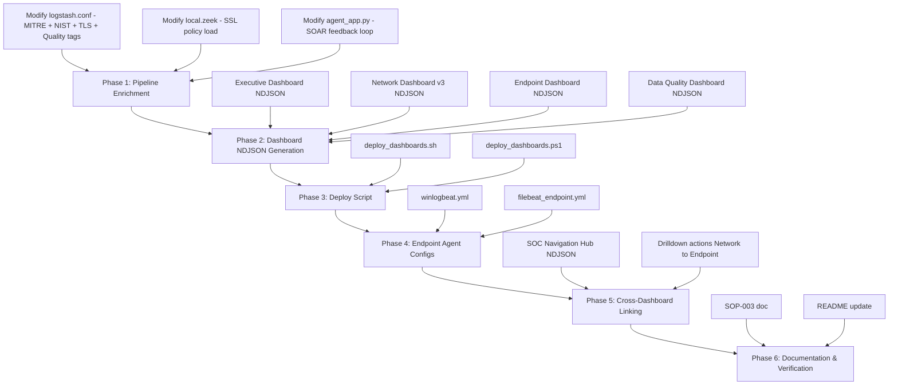

# Four-Dashboard SOC Monitoring Ecosystem — Implementation Plan

> **Project:** Suburban-SOC Network Pipeline  
> **Stack:** ELK 9.3.2 · Zeek 6.x · Ubuntu 24.04 LTS · Docker Compose  
> **Scope:** Build four modular Kibana dashboards, the supporting data pipelines, and an automated deploy script

---

## Architecture Review & Gap Analysis

Your document proposes four dashboard layers. Here is where the current Suburban-SOC pipeline stands against each:

| Dashboard | Current State | Gap |
|---|---|---|
| **1. Executive / Bird's-Eye** | Partial — [weekly_ciso_report.py](file:///wsl$/Ubuntu/home/tjlam/projects/Suburban-SOC/scripts/setup/ai_agent/weekly_ciso_report.py) generates a PDF with NIST/MTTD metrics, but there is **no live Kibana dashboard** for this | Need a full Kibana dashboard with KPIs, MITRE heatmap, NIST breakdown, and MTTD trend |
| **2. Network & Traffic** | ✅ **Mostly built** — existing NDJSON exports in [configs/server/](file:///wsl$/Ubuntu/home/tjlam/projects/Suburban-SOC/configs/server) have GeoIP map, source IP pie chart, and Talos intel table. DNS fields (`dns.question.name`, `dns.response.code`) and HTTP fields (`http.request.method`, `http.response.status_code`) are already ECS-mapped by Logstash but **not visualized** | Need: traffic volume timeline, top ports bar chart, SNI/server-name panel, cipher-suite/TLS auditing panel, DNS query panel, HTTP method breakdown |
| **3. Endpoint & Host-Level** | Partial — [logstash.conf](file:///wsl$/Ubuntu/home/tjlam/projects/Suburban-SOC/configs/logstash.conf) already has Sysmon + `auth.log` parsing (Category 2), 10 Sigma rules exist in [rules/sigma/](file:///wsl$/Ubuntu/home/tjlam/projects/Suburban-SOC/rules/sigma). **No Kibana dashboard** surfaces this data | Need a full dashboard + Winlogbeat/Filebeat endpoint agent config |
| **4. Data Quality & Ingestion** | ❌ **Nothing exists** | Need pipeline health metrics, agent heartbeat tracking, parsing error panels |

> [!IMPORTANT]
> **Update (WS0.1):** The ELK stack now runs `xpack.security.enabled=true` with TLS (see [docker-compose.yml](file:///wsl$/Ubuntu/home/tjlam/projects/Suburban-SOC/scripts/setup/docker-compose.yml)). Kibana Alerting rules and Watcher features that query `.alerts-security.alerts-*` now have the security feature they require; API calls must authenticate (basic auth as `elastic`, or a scoped service account).

> [!WARNING]
> **SOAR feedback loop gap:** Currently, quarantine actions and AI triage results from [agent_app.py](file:///wsl$/Ubuntu/home/tjlam/projects/Suburban-SOC/scripts/setup/ai_agent/agent_app.py) are sent to ntfy and Discord but are **never written back to Elasticsearch**. This means your dashboards can't show "how many devices were quarantined this week" or "what did the AI recommend." The plan includes a fix — the AI Agent will POST SOAR action results back to a `soar-actions-*` index so the Executive Dashboard can track automated response metrics.

---

## User Review Required

> [!WARNING]
> **Endpoint telemetry data source:** Dashboard 3 (Endpoint) requires either **Winlogbeat + Sysmon** on Windows hosts or **Auditbeat** on Linux hosts actively shipping to your ELK stack. Your Logstash config already parses these formats, but the agents may not be deployed. Confirm which hosts you want to monitor so the plan targets the right agent configs.

> [!IMPORTANT]
> **TLS/SSL auditing (Dashboard 2):** To get cipher suite and SNI data, Zeek needs `@load policy/protocols/ssl/validate-certs` and `@load base/protocols/ssl` in [local.zeek](file:///wsl$/Ubuntu/home/tjlam/projects/Suburban-SOC/configs/zeek/local.zeek). This will generate `ssl.log` — confirm this won't overwhelm your storage on the mesh router's traffic volume.

## Open Questions

1. **Elasticsearch authentication:** Enabling `xpack.security.enabled=true` is needed for native Kibana alerting (MTTD tracking). Are you ready to add basic auth to the stack, or should we keep security disabled and compute MTTD externally via your existing Python pipeline?

2. **Endpoint scope:** Which machines should ship endpoint logs? Options:
   - The WSL Ubuntu host running the pipeline (syslog + auth.log only)
   - Windows lab workstations (Sysmon + Winlogbeat)
   - Both

3. **Dashboard navigation hub:** Your integration tip suggests drill-down linking between dashboards. Should we create a **5th "SOC Home" dashboard** that acts as a navigation hub linking to all four, or just use Kibana's built-in dashboard list?

---

## Proposed Changes

### Component 1: Executive / Bird's-Eye Dashboard

This dashboard surfaces the KPIs already computed by [weekly_ciso_report.py](file:///wsl$/Ubuntu/home/tjlam/projects/Suburban-SOC/scripts/setup/ai_agent/weekly_ciso_report.py) but in real-time within Kibana.

#### [NEW] [executive_dashboard.ndjson](file:///wsl$/Ubuntu/home/tjlam/projects/Suburban-SOC/configs/server/executive_dashboard.ndjson)

Kibana Saved Objects bundle containing:

| Panel | Visualization Type | Data Source | Description |
|---|---|---|---|
| **SOC Header** | Markdown | Static | Executive banner: "Suburban-SOC — Executive Overview" |
| **Total Events (24h)** | Metric | `logstash-*` count | Total documents indexed in last 24 hours |
| **EPS Gauge** | TSVB Gauge | `logstash-*` derivative | Events Per Second — rolling 5-minute average |
| **Unresolved Critical Incidents** | Metric | `logstash-*` + `tags:CRITICAL_THREAT` | Count of unresolved critical alerts |
| **MTTD Trend** | TSVB Line | `.alerts-security.alerts-*` OR computed field | Mean Time to Detection over last 7 days, plotted daily |
| **NIST CSF Donut** | Pie/Donut | `logstash-*` + `nist.function.keyword` | Alert distribution across Identify/Protect/Detect/Respond/Recover |
| **MITRE ATT&CK Heatmap** | Heatmap / Table | `logstash-*` + `threat.technique.id.keyword` | Active alert counts mapped to ATT&CK technique IDs |
| **Alert Severity Timeline** | Area chart | `logstash-*` + `event.severity` | Stacked area showing critical/high/medium/low over time |
| **SOAR Actions (24h)** | Metric + Table | `soar-actions-*` index | Devices quarantined, AI triage summaries, response latency |
| **Automated vs Manual Response** | Pie | `soar-actions-*` + `action.type` | Ratio of automated SOAR responses to manual analyst actions |

#### [MODIFY] [agent_app.py](file:///wsl$/Ubuntu/home/tjlam/projects/Suburban-SOC/scripts/setup/ai_agent/agent_app.py)

Add SOAR action logging back to Elasticsearch so the Executive Dashboard can track automated responses:

```diff
+ def log_soar_action(action_type, target_ip, target_mac, ai_summary, severity):
+     """Indexes SOAR response actions back to Elasticsearch for dashboard tracking."""
+     import requests as _requests
+     doc = {
+         "@timestamp": datetime.utcnow().isoformat() + "Z",
+         "action.type": action_type,
+         "source.ip": target_ip,
+         "source.mac": target_mac,
+         "ai.summary": ai_summary,
+         "event.severity": severity,
+     }
+     try:
+         _requests.post(
+             "http://elasticsearch:9200/soar-actions-" + datetime.utcnow().strftime("%Y.%m.%d") + "/_doc",
+             json=doc, timeout=5
+         )
+     except Exception as e:
+         app.logger.error("Failed to index SOAR action: %s", e)
```

#### [MODIFY] [logstash.conf](file:///wsl$/Ubuntu/home/tjlam/projects/Suburban-SOC/configs/logstash.conf)

Add MITRE ATT&CK and NIST enrichment tags in the filter block:

```diff
  # --- Category 4: Threat Detection & Alerting ---
+ # --- Category 5: Framework Enrichment (Executive Dashboard) ---
+ # MITRE ATT&CK enrichment based on Zeek notice types
+ if [note] == "Scan::Port_Scan" {
+   mutate {
+     add_field => {
+       "[threat][technique][id]" => "T1046"
+       "[threat][technique][name]" => "Network Service Discovery"
+       "[threat][tactic][name]" => "Discovery"
+       "[nist][function]" => "Detect"
+     }
+   }
+ }
+ if [auth_success] == "false" and [event][dataset] == "zeek.ssh" {
+   mutate {
+     add_field => {
+       "[threat][technique][id]" => "T1110"
+       "[threat][technique][name]" => "Brute Force"
+       "[threat][tactic][name]" => "Credential Access"
+       "[nist][function]" => "Detect"
+     }
+   }
+ }
+ # Sysmon-based MITRE tagging (from Sigma rules)
+ if [process][executable] =~ "powershell" and [process][args] =~ "-enc" {
+   mutate {
+     add_field => {
+       "[threat][technique][id]" => "T1059.001"
+       "[threat][technique][name]" => "PowerShell"
+       "[threat][tactic][name]" => "Execution"
+       "[nist][function]" => "Detect"
+     }
+   }
+ }
```

---

### Component 2: Network & Traffic Ingress/Egress Dashboard (Enhancement)

Builds on your existing [live_operations_dashboard_final.ndjson](file:///wsl$/Ubuntu/home/tjlam/projects/Suburban-SOC/configs/server/live_operations_dashboard_final.ndjson) by adding the missing panels.

#### [NEW] [network_dashboard_v3.ndjson](file:///wsl$/Ubuntu/home/tjlam/projects/Suburban-SOC/configs/server/network_dashboard_v3.ndjson)

| Panel | Visualization Type | Data Source | Description |
|---|---|---|---|
| **Traffic Volume Timeline** | TSVB Area | `logstash-*` count over `@timestamp` | Total connection volume over time (line + area) |
| **Top Source IPs (Internal)** | Data Table | `source.ip.keyword` terms agg | Top 15 talking internal hosts |
| **Top Destination IPs (External)** | Data Table | `destination.ip.keyword` terms agg | Top 15 external destinations |
| **Top Destination Ports** | Horizontal Bar | `destination.port` terms agg | Port distribution (443, 80, 22, 3389, etc.) |
| **Transport Protocol Breakdown** | Pie | `network.transport.keyword` terms agg | TCP vs UDP vs ICMP distribution |
| **GeoIP World Map** | Coordinate Map | `destination.geo.location` geohash_grid | Already exists — reuse `soc-threat-map` |
| **DNS Query Domains** | Data Table | `dns.question.name.keyword` terms agg | Top queried domains — already ECS-mapped, just not visualized |
| **DNS Response Codes** | Pie | `dns.response.code.keyword` terms agg | NOERROR vs NXDOMAIN vs SERVFAIL distribution (DGA/tunnel detection) |
| **HTTP Methods** | Horizontal Bar | `http.request.method.keyword` terms agg | GET/POST/PUT/DELETE breakdown — already ECS-mapped |
| **HTTP Status Codes** | Pie | `http.response.status_code` terms agg | 200/301/403/404/500 distribution |
| **SNI / Server Name Table** | Data Table | `tls.client.server_name.keyword` | Top outbound TLS server names (requires `ssl.log`) |
| **Cipher Suite Audit** | Horizontal Bar | `tls.cipher.keyword` | Active cipher suites — flag weak/legacy ciphers |
| **Cross-Border Traffic** | Tag Cloud | `destination.geo.country_name.keyword` | Country distribution of external connections |
| **Talos Threat Intel Feed** | Data Table | Already exists — reuse `soc-intel-feed` | Linked IP lookups |

#### [MODIFY] [local.zeek](file:///wsl$/Ubuntu/home/tjlam/projects/Suburban-SOC/configs/zeek/local.zeek)

```diff
  @load base/protocols/conn
  @load policy/protocols/conn/mac-logging
+ @load base/protocols/ssl
+ @load policy/protocols/ssl/validate-certs
+ @load policy/protocols/ssl/log-hostcerts-only
```

This generates `ssl.log` with fields: `server_name`, `cipher`, `curve`, `version`, `validation_status`.

#### [MODIFY] [logstash.conf](file:///wsl$/Ubuntu/home/tjlam/projects/Suburban-SOC/configs/logstash.conf) — SSL/TLS field mapping

```diff
  # Map raw fields to ECS Network & Application fields + Zeek IPs
  mutate {
    rename => {
      # ... existing renames ...
+     "[network_parsed][server_name]"       => "tls.client.server_name"
+     "[network_parsed][cipher]"            => "tls.cipher"
+     "[network_parsed][curve]"             => "tls.curve"
+     "[network_parsed][version]"           => "tls.version"
+     "[network_parsed][validation_status]" => "tls.validation_status"
    }
  }
```

---

### Component 3: Endpoint & Host-Level Monitoring Dashboard

#### [NEW] [endpoint_dashboard.ndjson](file:///wsl$/Ubuntu/home/tjlam/projects/Suburban-SOC/configs/server/endpoint_dashboard.ndjson)

| Panel | Visualization Type | Data Source | Description |
|---|---|---|---|
| **Endpoint Header** | Markdown | Static | "Endpoint & Host-Level Monitoring" |
| **Process Tree Anomalies** | Data Table | `process.parent.name` + `process.executable` | Unusual parent-child spawns (e.g., `w3wp.exe` to `cmd.exe`) |
| **High-Risk Command Lines** | Data Table | `process.args` keyword search | Commands matching encoded PowerShell, LSASS dump, etc. |
| **Authentication Timeline** | TSVB Line | `event.outcome` (success/failure) over time | Login success vs failure trendline |
| **Brute Force Detection** | Metric + Table | `event.outcome: failure` count by `source.ip` | Top failed-auth sources (SSH/RDP brute force) |
| **Privilege Escalation Events** | Data Table | `event.action: "session_opened"` + `user.name: root` | sudo/runas activity tracking |
| **Mass File Modification** | Metric | Sysmon Event 11 count spike | Ransomware early warning — bulk file creates/renames |
| **Failed SSH by Country** | Pie | `source.geo.country_name` filtered to `event.outcome: failure` | Geographic origin of brute-force attempts |
| **System Reboots** | Metric | Windows Event 1074/6006 or Linux `shutdown` | Unexpected restart tracking |
| **Sigma Rule Hits** | Data Table | `tags: sigma_*` | Active detections from your 10 translated Sigma rules |

#### [NEW] [winlogbeat.yml](file:///wsl$/Ubuntu/home/tjlam/projects/Suburban-SOC/configs/endpoint/winlogbeat.yml)

Winlogbeat configuration for Windows lab hosts:

```yaml
winlogbeat.event_logs:
  - name: Microsoft-Windows-Sysmon/Operational
    event_id: 1, 3, 7, 8, 11, 13, 15
  - name: Security
    event_id: 4624, 4625, 4648, 4672, 4720, 4732
  - name: System
    event_id: 1074, 6005, 6006, 6008

output.logstash:
  hosts: ["${LOGSTASH_HOST:localhost:5044}"]
```

#### [NEW] [filebeat_endpoint.yml](file:///wsl$/Ubuntu/home/tjlam/projects/Suburban-SOC/configs/endpoint/filebeat_endpoint.yml)

Filebeat configuration for Linux endpoint monitoring:

```yaml
filebeat.inputs:
  - type: filestream
    id: auth-logs
    paths:
      - /var/log/auth.log
      - /var/log/secure
    parsers:
      - syslog: ~

  - type: filestream
    id: syslog
    paths:
      - /var/log/syslog
      - /var/log/messages

output.logstash:
  hosts: ["${LOGSTASH_HOST:localhost:5044}"]
```

#### [MODIFY] [logstash.conf](file:///wsl$/Ubuntu/home/tjlam/projects/Suburban-SOC/configs/logstash.conf) — Enhanced endpoint parsing

```diff
  # If processing Windows Sysmon Events via Winlogbeat
  if [winlog][channel] == "Microsoft-Windows-Sysmon/Operational" {
    mutate {
      rename => {
        "[winlog][event_data][Image]"           => "process.executable"
        "[winlog][event_data][CommandLine]"     => "process.args"
        "[winlog][event_data][ParentImage]"     => "process.parent.name"
        "[winlog][event_data][User]"            => "user.name"
        "[winlog][event_data][TargetUserName]"  => "user.target.name"
+       "[winlog][event_data][TargetFilename]"  => "file.path"
+       "[winlog][event_data][Hashes]"          => "file.hash.sha256"
      }
    }
+   # Tag Sigma-matched detections for the Endpoint dashboard
+   if [process][executable] =~ "\\rundll32\.exe" and [process][args] =~ "comsvcs" {
+     mutate { add_tag => ["sigma_lsass_dump", "CRITICAL_THREAT"] }
+   }
+   if [process][executable] =~ "\\wevtutil\.exe" and [process][args] =~ "cl|clear-log" {
+     mutate { add_tag => ["sigma_event_log_clear"] }
+   }
  }
+
+ # Windows Security Events (4624/4625 login tracking)
+ if [winlog][channel] == "Security" {
+   if [winlog][event_id] == 4625 {
+     mutate { add_field => { "[event][outcome]" => "failure" } }
+   }
+   if [winlog][event_id] == 4624 {
+     mutate { add_field => { "[event][outcome]" => "success" } }
+   }
+ }
```

---

### Component 4: Data Quality & Ingestion Triage Dashboard

#### [NEW] [dataquality_dashboard.ndjson](file:///wsl$/Ubuntu/home/tjlam/projects/Suburban-SOC/configs/server/dataquality_dashboard.ndjson)

| Panel | Visualization Type | Data Source | Description |
|---|---|---|---|
| **Pipeline Health Header** | Markdown | Static | "Data Quality & Ingestion Triage" |
| **Active Agent Count** | Metric | `agent.hostname.keyword` unique count | Number of distinct Filebeat/Winlogbeat agents shipping |
| **Agents by Hostname** | Data Table | `agent.hostname.keyword` terms agg | Per-agent document counts with last-seen timestamp |
| **Index Storage Size** | Metric | Elasticsearch `_cat/indices` API (via Canvas or Timelion) | Total size of `logstash-*` indices |
| **Document Ingest Rate** | TSVB Area | `logstash-*` count per minute | Real-time ingestion throughput (should match EPS on Exec dashboard) |
| **JSON Parse Errors** | Metric + Table | `tags: _jsonparsefailure` count | Documents that failed JSON parsing in Logstash |
| **Mapping Errors** | Data Table | `tags: _grokparsefailure` or `error.message: *mapper_parsing*` | Type conflicts and unmappable fields |
| **NDJSON Parse Errors** | Metric | Filebeat `error.key` field | Filebeat-level parse failures |
| **Document Lag** | TSVB Line | `@timestamp` vs `event.created` delta | Time delta between event occurrence and indexing |
| **Stale Agents (>15min)** | Data Table | `agent.hostname.keyword` where max `@timestamp` > 15min ago | Agents that stopped shipping — early pipeline failure alert |

#### [MODIFY] [logstash.conf](file:///wsl$/Ubuntu/home/tjlam/projects/Suburban-SOC/configs/logstash.conf) — Ingest metadata for quality tracking

```diff
  # --- Category 3: Operational Metadata Enrichment ---
  mutate {
    add_field => {
      "[@metadata][pipeline]" => "security-enrichment"
+     "[event][created]" => "%{+yyyy-MM-dd'T'HH:mm:ss.SSSZ}"
    }
    # Ensure all field copies capture structural tracking metrics
    copy => {
      "[agent][name]" => "agent.hostname"
      "[log][file][path]" => "log.file.path"
    }
  }
+
+ # Tag parse failures for the Data Quality dashboard
+ if "_jsonparsefailure" in [tags] or "_grokparsefailure" in [tags] {
+   mutate {
+     add_field => { "[pipeline][error]" => "true" }
+   }
+ }
```

---

### Component 5: Automated Deployment Script

#### [NEW] [deploy_dashboards.sh](file:///wsl$/Ubuntu/home/tjlam/projects/Suburban-SOC/scripts/setup/deploy_dashboards.sh)

A single script that:

1. Validates Elasticsearch is reachable on `:9200`
2. Validates Kibana is reachable on `:5601`
3. Imports all four dashboard NDJSON files via the Kibana Saved Objects API:
   ```bash
   curl -X POST "http://localhost:5601/api/saved_objects/_import?overwrite=true" \
     -H "kbn-xsrf: true" \
     --form file=@configs/server/executive_dashboard.ndjson
   ```
4. Creates the `logstash-*` data view if it doesn't exist
5. Installs/updates Elastic Watchers from `rules/elastic_watcher/`
6. Copies the updated `logstash.conf` to the Docker mount path and restarts Logstash
7. Prints a summary table of what was deployed

#### [NEW] [deploy_dashboards.ps1](file:///wsl$/Ubuntu/home/tjlam/projects/Suburban-SOC/scripts/setup/deploy_dashboards.ps1)

PowerShell equivalent for Windows-native deployment (mirrors the bash script).

---

### Component 6: Cross-Dashboard Drill-Down Links

#### [NEW] [soc_navigation_hub.ndjson](file:///wsl$/Ubuntu/home/tjlam/projects/Suburban-SOC/configs/server/soc_navigation_hub.ndjson)

A lightweight "SOC Home" dashboard with:

| Panel | Content |
|---|---|
| **Navigation Grid** | Markdown panel with clickable links to all four dashboards |
| **System Status** | Last heartbeat from each agent class (network, endpoint, pipeline) |
| **Quick KPIs** | Total events (1h), active agents, open critical alerts |

Each dashboard will include a "Back to SOC Home" markdown link in its header panel, and the GeoIP map on the Network Dashboard will use Kibana drilldown actions to navigate to the Endpoint Dashboard filtered by the clicked `source.ip`.

---

### Component 7: Documentation

#### [NEW] [SOP-003-dashboard-operations.md](file:///wsl$/Ubuntu/home/tjlam/projects/Suburban-SOC/docs/SOP-003-dashboard-operations.md)

SOP covering:
- How to deploy/update dashboards using the deploy script
- How to verify each dashboard has data
- How to add new panels
- Troubleshooting blank panels (missing fields, wrong time range)

#### [MODIFY] [README.md](file:///wsl$/Ubuntu/home/tjlam/projects/Suburban-SOC/README.md)

Add a "Dashboard Architecture" section to the main README documenting the four-dashboard ecosystem.

---

## File Summary

| Action | File | Component |
|---|---|---|
| **NEW** | `configs/server/executive_dashboard.ndjson` | Dashboard 1 |
| **NEW** | `configs/server/network_dashboard_v3.ndjson` | Dashboard 2 |
| **NEW** | `configs/server/endpoint_dashboard.ndjson` | Dashboard 3 |
| **NEW** | `configs/server/dataquality_dashboard.ndjson` | Dashboard 4 |
| **NEW** | `configs/server/soc_navigation_hub.ndjson` | Navigation Hub |
| **NEW** | `configs/endpoint/winlogbeat.yml` | Endpoint agent |
| **NEW** | `configs/endpoint/filebeat_endpoint.yml` | Endpoint agent |
| **MODIFY** | `configs/logstash.conf` | Pipeline enrichment |
| **MODIFY** | `configs/zeek/local.zeek` | SSL/TLS telemetry |
| **MODIFY** | `scripts/setup/ai_agent/agent_app.py` | SOAR feedback loop |
| **NEW** | `scripts/setup/deploy_dashboards.sh` | Deployment automation |
| **NEW** | `scripts/setup/deploy_dashboards.ps1` | Deployment automation |
| **NEW** | `docs/SOP-003-dashboard-operations.md` | Documentation |
| **MODIFY** | `README.md` | Documentation |

---

## Implementation Order



---

## Verification Plan

### Automated Tests

```bash
# 1. Validate all NDJSON files are valid JSON lines
for f in configs/server/*.ndjson; do
  while IFS= read -r line; do
    echo "$line" | jq . > /dev/null || echo "FAIL: $f"
  done < "$f"
done

# 2. Verify Logstash config parses without error
docker run --rm -v $(pwd)/configs/logstash.conf:/pipeline.conf \
  docker.elastic.co/logstash/logstash:9.3.2 \
  logstash --config.test_and_exit -f /pipeline.conf

# 3. Deploy all dashboards and confirm import
./scripts/setup/deploy_dashboards.sh

# 4. Verify each dashboard exists in Kibana
for id in "executive-dashboard" "network-dashboard-v3" "endpoint-dashboard" "dataquality-dashboard" "soc-navigation-hub"; do
  curl -s "http://localhost:5601/api/saved_objects/dashboard/$id" | jq '.id'
done

# 5. Run a test capture cycle and verify data in all four dashboards
# (Use the existing SOP-001/SOP-022 simulation workflow)
```

### Manual Verification

1. **Open each dashboard** in Kibana at `http://<WSL-IP>:5601` and confirm panels render with data
2. **Click the GeoIP map** on the Network Dashboard — verify it drills down to the Endpoint Dashboard filtered by the clicked IP
3. **Stop Filebeat** for 20 minutes — verify the "Stale Agents" panel on the Data Quality Dashboard lights up
4. **Inject a `_jsonparsefailure`** event — verify it appears on the Data Quality Dashboard's error panel
5. **Run `tests/anomaly_simulation/run_all.sh`** — verify MITRE ATT&CK heatmap and NIST donut update on the Executive Dashboard
6. **Navigate via SOC Home** — confirm all four dashboard links work
